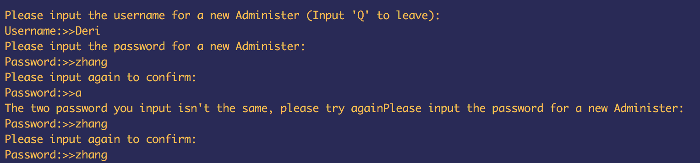

# Documentation
## 小组成员：
1. 张思宇 11612326
2. 徐源诚 11611010
3. 罗琦琛 11612322

### 分工：
#### 张思宇
> 管理员功能：
        1. 创建新管理员
        2. 更新管理员信息（修改自己的账号和密码）
        3. 创建航班
        4. 删除航班
        5. 超级查询（管理员查询）
        6. 更新航班信息
        7. 修改航班信息
        8.管理员注册及登录（数据库中）
>  乘客功能：
        1. 查询航班

#### 徐源诚
> 乘客功能：
      1. 创建新乘客账户
      2. 预订机票
      3. 退订机票
      4. 乘客注册及登录功能。（数据库中）
>管理员功能
      1.修改并更新航班信息（部分）
      2.管理员注册以及登录（部分）（数据库中）
      3.创建航班（部分）

#### 罗琪琛
> 主函数：
    1. 操作界面
    2. 乘客登录
    3. 管理员登录
> 后期的Debug，对功能的调整。
注释：因为前期很多功能做得比较粗糙，因此debug是一个很重要，工作量也比较大的工作。

### 基本功能的实现及描述
#### 管理员功能：
##### 1. 创建航班
>  * 依次要求输入构造函数的信息，将信息储存再一个数组中，利用数组结合构造函数进行初始化。
* 在输入起飞时间时会同时对日期和时间进行检测，如果 起飞日期 = 当前日期，且同时 起飞时间在当前时间两小时以内，则会提示时间不合理。
* 另外写了方法
  1. 传入两个String类型的日期（如 2017-01-02），将年月日分别用整型变量提取出来，进行比较。如果日期相同则返回一个布尔代数true；
  2. 传入一个String类型的时间（如12:00），返回一个代表总分钟数的整型，用于进行时间比较。
* 如果日期相等，同时  起飞时间总分钟数-当前时间总分钟数 <=120则要求重新输入适当的起飞时间
* 另外要求输入了到达日期，如果到达日期和出发日期相同，切 起飞时间总分钟数<=到达时间总分钟数，则要求重新输入到达时间。

>此图片展示了，当试图使用已经使用过的航班ID，和将起飞时间设置在当前时间2小时内，以及将到达时间设置为等于或小于起飞时间时出现报错的情况

>此图片展示了，当试图将中转城市设定为与起飞城市相同，或者将到达城市设定为与起飞、中转城市相同，出现错误提示的情况
##### 2. 修改航班
>  * 该项功能分为两个方法，第一个传入一个Flight类型的变量，并对其进行修改的方法，第二个为先显示所有航班基本信息，输入想要修改的航班的航班号再进行修改。在管理员的”查询航班“功能中，可以调用第一个方法对查询到的航班进行修改； 主函数的 “修改航班”功能则直接调用了第二个方法。
>  * 输入要修改航班的编号后，会先遍历储存有所有航班的Flight类型的ArrayList，找到指定航班；然后要求选择需要修改的信息，用switch来跳转，修改对应航班的对应信息。

>此图片显示了修改航班信息的页面，此处，选择将航班发布。

>如果航班已经发布，只能修改部分信息，如果已经终结，则无法修改信息

##### 3. 删除航班
>   * 然后会要求输入航班号，会先遍历储存有所有航班的Flight类型的ArrayList，找到指定航班，保存该航班的索引到一个整型变量，然后删除这个整型变量。
>  * 特点：在每一步操作结束后 都会再次询问‘是否进行该操作’，删除结束后会询问‘是否继续删除作业’。

>未发布和已经终结的航班可以被删除

>已经发布的航班则不能被删除

##### 4. 高级查询
###### 4.1. 航班号查询（包含模糊查询功能）
>   * 要求输入需要查询的航班号（或其包含的部分），储存为字符串
* 遍历字符串，将其中每一个字符分开，储存到一个字符类型的数组中
* 遍历航班列表中的每一个航班，用i来表示输入字符数组的位数，j表示航班号的位数。如果输入字符数组的第一位与航班中第一个字符相同，则i+1，j+1； 否则j+1，继续进行比较，直到遍历完整一个输入内容；如果此时i等于搜索字符数组长度，则显示结果；否则不显示结果。

>图为模糊查询演示，查询到的结果会依次显示。

###### 4.2. 查询订单
* 遍历并显示整个订单列表

###### 4.3. 通过具体信息查询
* 要求用户分别输入 出发城市、到达城市和日期的信息，遍历储存航班的Arraylist进行查询。
* 特点：在每一项信息处，可以输入‘Q’，代表此项信息不作输入。
      实现方法：新建一个整型的变量 choice（初始值为0），如果 出发城市为‘Q’，则choice 自加1；如果到达城市为‘Q’则choice自加2；如果日期为‘Q’，则choice自加4；然后将choice作为switch的因子，以choice的值确定要对哪些信息进行检索。

>完整信息查询

>非完整信息查询

##### 5. 用户管理
>  1. 创建新管理员
   * 带有用户名查重和确认密码功能

>  2. 更新管理员信息（修改自己的账号密码）
   * 需要先登录
   * 带有用户名查重和确认密码功能

##### 6. 查询航班
> 先选择需要进入的查询模式
###### 1. 通过细节信息查询航班
同管理员功能4.3
###### 2. 通过航班ID查询
同管理员同能4.1

> 由于上面两项功能与管理员基本相同（实际上代码也基本上直接从管理员的功能中复制），因此只演示搜索到指定航班后，预订该航班的共功能。

###### 3. 查看自己的订单列表

#### 管理员功能：
##### 1.登录与注册。
> 1.若直接登录会显示错误，并自动跳转到注册界面
！

##### 2. 预订航班
> 1. （先使用admin.update()功能调好各个航班的状态 并且确保新建了乘客）
> 2.  调用预定方法，依次输入flightID,seat number，special demand,个人的信息。

> * 特点 1.预定之后自动在该flight人数+1，若人数满后则自动变成full状态。
> * 特点 2.每次新的reserve都会给出已经选的seatnum。
##### 3. 退订航班
> 1.先使用预定航班预定至少一个flight
> 2.输入客户自己的信息，自动显示出客户自己所有的订单信息，通过输入对应的order编号进行退订。

> * 特点 1.可以一次运行，多次退订。
> * 特点 2.退订后同时在该乘客obect的orederlist与数据库中删除。
#### 系统需求加分项目
##### 1. 主函数操作界面

>管理员操作界面
>乘客操作界面
##### 2. 对查询功能和高级查询功能的增强
  1. 在查询到航班后，可以选择对其进行后续操作（如修改航班信息，预订航班等），或者继续查询，或者退出查询
  
  2. 在根据起飞城市、到达城市和起飞日期查询航班功能中，可以不输入完整信息，即通过三项中的任意一项或者两项信息对航班进行查询
  
##### 3. 对删除共功能的增强
进入删除功能时，会显示所有航班列表，然后要求选择航班号进行删除。删除之后，可以选择继续删除，或者退出删除。
##### 4. 对创建航班功能的增强

  1. 录入任意信息时，可以输入‘Q’来结束创建航班;

  2. 创建航班时，录入航班号时，有查重功能
##### 5. 对乘客登录功能的增强
  1. 注册时，输入密码后需要确认密码，如果两次密码不符合会要求重新输入密码
  2. 用户名的查重功能
##### 6. 可以从系统读取时间

